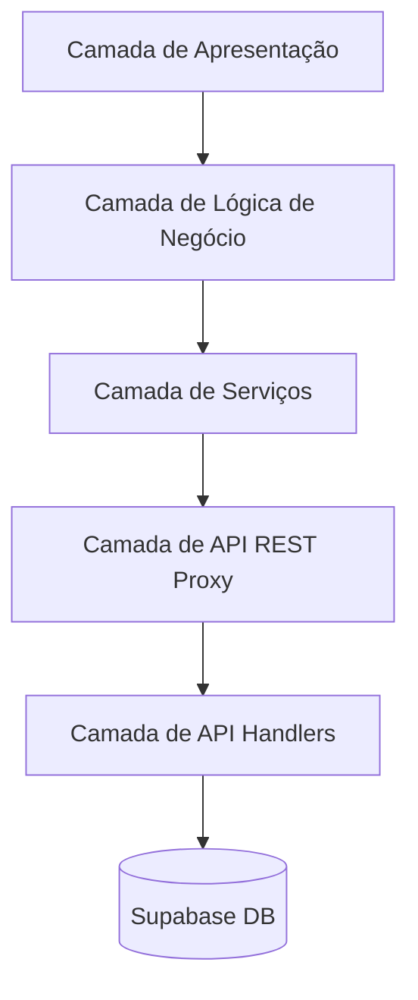

# 01. Visão Geral da Arquitetura

## Introdução

O projeto **Dayane Anastácio LP** utiliza uma **Arquitetura em Camadas** que promove:

- **Separação de Responsabilidades**: Cada camada tem um propósito específico.
- **Manutenibilidade**: Alterações em uma camada não afetam as outras.
- **Testabilidade**: As camadas podem ser testadas de forma independente.
- **Escalabilidade**: Facilidade para adicionar novas funcionalidades seguindo padrões.

---

## Tech Stack

### Frontend

- **Next.js 15 (App Router)**: Framework React principal.
- **React 18**: Biblioteca de UI.
- **TypeScript**: Tipagem estática.
- **Tailwind CSS**: Estilização baseada em utilitários.
- **React Hook Form + Zod**: Gerenciamento e validação de formulários.

### Backend & Integração

- **Supabase**: Backend-as-a-Service para banco de dados e autenticação.
- **Next.js Route Handlers**: Camada de API Proxy.

---

## Diagrama de Arquitetura

### 1. Camada de Apresentação (Presentation)

Responsável pela renderização da interface e eventos do usuário.

- **Local**: `src/app/{module}/{feature}/components/`
- **Exemplo**: `DiagnosticWizard.tsx`

### 2. Camada de Lógica de Negócio (Business Logic)

Contém regras de negócio, validações e orquestração de estado.

- **Entidades (Entities)**: `src/shared/entities/{module}/` (Schemas Zod e tipos).
- **Hooks**: `src/app/{module}/{feature}/hooks/` (hooks customizados como `use-diagnostico-form.ts`).

### 3. Camada de Serviços (Service Layer)

Encapsula chamadas HTTP para a nossa própria API.

- **Local**: `src/services/{module}/*.service.ts`
- **Config**: `src/services/api.ts`

### 4. Camada de API REST (Proxy)

Endpoints do Next.js que garantem segurança e validação no servidor.

- **Local**: `src/app/api/{module}/route.ts`

### 5. Camada de API Handlers

Onde a mágica do banco de dados acontece. Faz a ponte direta com o Supabase.

- **Local**: `src/shared/api-handlers/{module}/*.handler.ts`

---

**Próximos Passos:**

- **[02 - Camada de Apresentação](./02-presentation-layer.md)**
- **[03 - Camada de Lógica de Negócio](./03-business-logic-layer.md)**
- **[04 - Camada de Serviços](./04-service-layer.md)**
- **[05 - Camada de API REST](./05-api-layer.md)**
- **[06 - Camada de API Handlers](./06-api-handlers-layer.md)**
