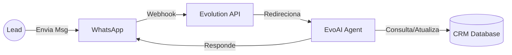

# Estratégia de Produto: Integração Evolution API + EvoAI 🤖

Este documento analisa como a integração com WhatsApp (Evolution API) e Inteligência Artificial (EvoAI) pode alavancar o produto, focando nas dores da persona "Advogado CEO" (sobrecarga no Wpp) e nos objetivos de negócio da Dayane.

## 🎯 Objetivo Macro

Transformar o WhatsApp de **vilão** (fonte de ansiedade e interrupção) em **canal de venda previsível** através de agentes autônomos.

---

## 💎 Propostas de Funcionalidades (O que construir?)

Aqui estão 3 "Módulos de IA" que podemos acoplar ao CRM atual, ordenados por **Impacto x Esforço**.

### 1. O "Concierge de Agendamento" (Foco: Conversão)

**Cenário**: O lead preenche o _Diagnóstico Inteligente_ e tira nota alta (Lead Quente).
**Ação da IA**:

1.  Recebe o webhook do formulário.
2.  Dispara no WhatsApp do Lead (após 5 min):
    > _"Olá Dr(a) [Nome]! Vi aqui que seu diagnóstico apontou nota máxima em Equipe, parabéns. A Dayane separou um horário na agenda VIP para discutir sua Gestão Financeira (seu ponto fraco). Tem disponibilidade quinta às 14h?"_
3.  **Objetivo**: Cortar o tempo de resposta ("Speed to Lead") para zero.
    **Nível de Esforço**: Médio (Webhook CRM -> Evolution API).

### 2. O "Filtro de Curiosos" (Foco: Qualidade de Vida)

**Cenário**: Pessoas chamam no WhatsApp perguntando "Preço?" ou "Dúvida rápida".
**Ação da IA**:

1.  EvoAI intercepta a mensagem antes da Dayane ver.
2.  Classifica a intenção: É Dúvida, Orçamento ou Cliente Atual?
3.  **Resposta Automática**:
    - _Se Orçamento_: "A Dayane trabalha com projetos personalizados. Para te passar o valor, preciso que preencha este Diagnóstico rápido: [Link]."
    - _Se Cliente_: "Oi Dr(a), vou passar para a Dayane e ela responde assim que sair da mentoria."
4.  **Objetivo**: Eliminar notificação de lead desqualificado.
    **Nível de Esforço**: Alto (Requer treino do agente no EvoAI).

### 3. A "Bioimpedância Ativa" (Foco: Reativação)

**Cenário**: Base de contatos antigos parada no CRM ou Excel.
**Ação da IA**:

1.  Disparo em massa (cadenciado) para lista fria.
2.  Mensagem de Valor (não venda):
    > _"Dr(a) [Nome], faz tempo que não nos falamos. Criei uma ferramenta nova que dá uma Nota para a gestão do seu escritório. Quer testar de graça? Responda SIM."_
3.  Se responder SIM -> Envia Link do Diagnóstico.
    **Objetivo**: Encher o funil sem esforço manual.
    **Nível de Esforço**: Baixo (Disparo simples).

---

## 🛠️ Arquitetura Sugerida

### Fluxo de Dados

### Stack Tecnológica

1.  **Evolution API**: Instância Docker já conhecida (Responsável pela conexão Wpp).
2.  **EvoAI**: Camada de "Cérebro" (Gerencia prompts, contexto e flows).
3.  **N8N ou Webhooks Next.js**: Para conectar o CRM (Supabase) com a Evolution API quando o gatilho for nosso (ex: Lead preencheu form).

---

## 🚦 Recomendação Imediata

Considerando que estamos focados no **Módulo de Diagnóstico (Sprint 3)**, a funcionalidade **#1 (Concierge)** é a que traz mais dinheiro novo rápido.

**Por quê?**
Quando o lead acaba de ver a nota dele no Diagnóstico, a dopamina está alta. Receber uma mensagem personalizada nesse segundo aumenta a conversão em até 400% (dados de mercado).
